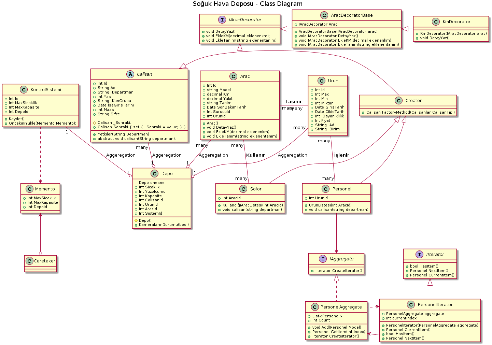
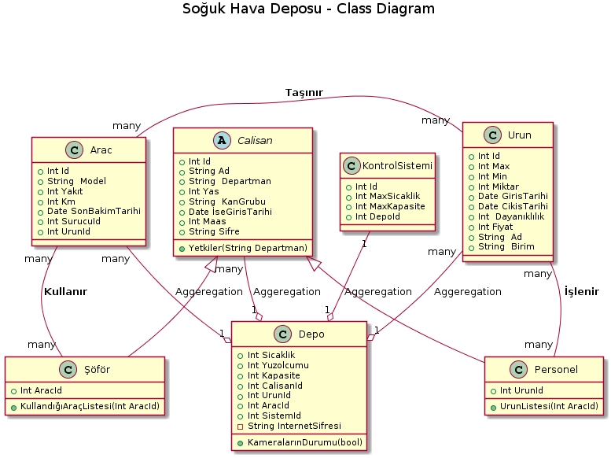

*SOĞUK HAVA DEPOSU*

Projede patternler ödevlerde verilen sıra ile gerçekleştirilmiştir.Aşağıda gerçekleştirilmeden önce ve sonrasına ait class diagramları ve plantumlleri mevcuttur.

= 1
Factory pattern,aynı interface'i veya abstract sınıfı implement etmiş etmiş factory nesnelerinin üretiminden sorumlu pattern dir.Projede çalışan departmanlarını üretmek amacıyla kullanılmıştır.Calisan sınıfından Personel ve Şöför üretilmiştir.

 Creater creater = new Creater();     
 Calisan calisan1 = creater.FactoryMethod(Calisanlar.Personel);
 Calisan calisan2 = creater.FactoryMethod(Calisanlar.Sofor);
 calisan1.calisan();
 calisan2.calisan();
 

= 2
Singleton pattern(tek nesne) tasarım kalıbı, bir sınıfın tek bir örneğini almak için kullanılır.Amaç oluşturulan nesneye global erişim noktası sağlamaktır.Sistem çalıştığı sürece ikinci bir örnek oluşturulmaz, böylelikle istenen nesnenin tek bir defa oluşturulması garanti altına alınacaktır.Singleton nesneler ilk çağırıldıklarında bir kere oluşturulurlar ve sonraki istekler bu nesne üzerinden karşılanır.

Yukarıda değindiğimiz bu pattern projede tek bir bina olduğu varsayılarak bir depo olması için kullanıldı.

    Depo depo1 = Depo.Depo_Nesnesi;
    depo1.Sicaklik = 5;
    Console.WriteLine("Depo1 nesnesi üretildi Depo1 Sıcaklık: " + depo1.Sicaklik + "\n");
    
    Depo depo2 = Depo.Depo_Nesnesi;
    depo2.Sicaklik = -10;
    Console.WriteLine("Depo2 nesnesi üretildi Depo2 Sıcaklık: " + depo2.Sicaklik + "\n");

    if (depo1 == depo2)
    {
     Console.WriteLine("Nesneler singleton pattern ile üretildiği için depo1 depo2'deki değişiklikten etkilendi.\n  Depo1 Sıcaklık: " + depo1.Sicaklik + "\n" + "  Depo2 Sıcaklık: " + depo2.Sicaklik);
    }

    else
    {
    Console.WriteLine("Nesneler farklıdır");
    }

= 3

Prototype (prototip) tasarım deseni creational grubununa ait, var olan nesnelerin kopyasının üretiminden sorumlu tasarım desenidir.Bu pattern projede kontrol sistemi için kontrol oluşturmak için kullanıldı.

  Kontrol kontrol1 = new Kontrol();
  kontrol1.MaxKapasite = 3000;
  kontrol1.MaxSicaklik = -3;
  Console.WriteLine("Kontrol1 oluşturuldu.\n");
  Console.WriteLine("Kontrol1 MaxKapasitesi: " + kontrol1.MaxKapasite + "  Kontrol1 MaxSıcaklık: " + kontrol1.MaxSicaklik + "\n\n");
  Kontrol kontrol2 = kontrol1.DeepCopy();
  kontrol2.MaxKapasite = 2000;
  kontrol2.MaxSicaklik = 0;

            Console.WriteLine("DeepCopy ile Kontrol2 oluşturuldu ve kontrol1 etkilenmedi." + "\n" + "Kontrol2 MaxKapasitesi: " + kontrol2.MaxKapasite + "  Kontrol2 MaxSıcaklık: " + kontrol2.MaxSicaklik + "\n" + "Kontrol1 MaxKapasitesi: " + kontrol1.MaxKapasite + "  Kontrol1 MaxSıcaklık: " + kontrol1.MaxSicaklik + "\n");
            var kontrol3 = kontrol1.ShallowCopy();

    Console.WriteLine("ShallowCopy ile Kontrol3 oluşturuldu ." + "\n" + "Kontrol3 MaxKapasitesi: " + kontrol3.MaxKapasite + "  Kontrol3 MaxSıcaklık: " + kontrol3.MaxSicaklik);

= 4

Object Pool tasarın deseni : İstenilen nesnelerin sürekli olarak üretilmesi yerine,  başlangıçta bir havuzu oluşturulur ve bu havuz nesneler ile doldurulur.
Projede kullanıcıların sisteme girişlerini sınırlamak için kullanılmıştır.
 
 
 Console.WriteLine("Havuzun boyutu {0}", ClientPool.Instance.Size);
 Console.WriteLine("Client sınıfı ediniyoruz.");
            var client1 = ClientPool.Instance.AcquireObject();
            client1.Connect();

 Console.WriteLine("Client'ı geri bırakıyoruz");
            if (client1 != null)
        ClientPool.Instance.ReleaseObject(client1);

            var clients = new List<Client>();
            for (int i = 0; i < ClientPool.Instance.Size; i++)
            {
                clients.Add(ClientPool.Instance.AcquireObject());
            }

 Console.WriteLine("Uygun olan tüm Client nesneleri listeye eklendi.");
  var nullClient = ClientPool.Instance.AcquireObject();
  
   if (nullClient == null)
 Console.WriteLine("Daha fazla Client sınıfı bulunmamaktadır.");
 
 Console.WriteLine("Havuzun boyutunu arttırıyoruz");
            ClientPool.Instance.IncreaseSize();

 Console.WriteLine("Yeni bir Client sınıfı ediniyoruz.");
            var newClient = ClientPool.Instance.AcquireObject();
            newClient.Connect();

 Console.WriteLine("Edindiğimiz sınıfı geri veriyoruz.");
    if (newClient != null)
    ClientPool.Instance.ReleaseObject(newClient);

 Console.WriteLine("Listedeki tüm Client sınıflarını geri bırakıyoruz.");
  foreach (var item in clients)
            {
                ClientPool.Instance.ReleaseObject(item);
            }
            
= 5

Abstract factory pattern ,tek arayüz kullanarak bir nesne ailesinin farklı platformlarda yaratılmasına olanak sağlar ve uygulama davranış değişikliğine uğramadan farklı platformlara taşınabilir.

Projede giriş yapılacak nesnelerden elma ve erik seçilerek yeşil ve kırmızı fabrikasında üretimi şekillendirilmiştir.

 IUrunFactory factory = new YesilFactory();
 Console.WriteLine("YeşilFactory çalıştı.\n");
            var YesilElma = factory.Elma();
            var YesilErik = factory.Erik();

 Console.WriteLine(YesilErik.ErikFeature());
 Console.WriteLine(YesilElma.ElmaFeature());

 IUrunFactory factory2 = new KırmızıFactory();
 Console.WriteLine("\nKırmızıFactory çalıştı.\n");
            var KırmızıElma = factory2.Elma();
            var KırmızıErik = factory2.Erik();

 Console.WriteLine(KırmızıErik.ErikFeature());
 Console.WriteLine(KırmızıElma.ElmaFeature());

= 6

Builder desende istemcinin kullanmak istediği gerçek ürünün birden fazla sunumunun olabileceği göz önüne alınır. Bu farklı sunumların üretimi ise Builder adı verilen nesnelerin sorumluluğu altındadır. Dolayısıyla Builder kalıbından yararlanılarak aslı ürünün farklı sunumlarının elde edilebilmesi için gerekli olan karmaşık üretim süreçleri, istemciden tamamen soyutlanabilir.

Projede urunden çeşitli ürünler üretilmek için kullanılmıştır.

 UrunBuilder urun = new ElmaBuilder();
 UrunUret uret = new UrunUret();
            uret.Uret(urun);
 Console.WriteLine(urun.Urun.ToString());

 urun = new ErikBuilder();
            uret.Uret(urun);
 Console.WriteLine(urun.Urun.ToString());
 
= 7

Iterator tasarım deseni ile koleksiyon yapısı bilinmesine ihtiyaç olmadan koleksiyon elemanları üzerinde işlem yapılabilmesini sağlar. Yani iterator tasarım deseni kullanılarak koleksiyonun array, queue, list olması önemli olmadan, aynı şekilde elemanlarının elde edilmesi sağlanır. Koleksiyon içindeki nesnelerin nasıl elde edileceği tercihe göre belirlenebilir. 

 PersonelAggregate aggregate = new PersonelAggregate();
            aggregate.Add(new Personel { Id = 1, Adi = "Personel1", SoyAdi = "Soyad1" });
            aggregate.Add(new Personel { Id = 2, Adi = "Personel2", SoyAdi = "Soyad2" });

            IIterator iterasyon = aggregate.CreateIterator();
            while (iterasyon.HasItem())
            {
                Console.WriteLine($"ID : {iterasyon.CurrentItem().Id}\nAdı : {iterasyon.CurrentItem().Adi}\nSoyadı : {iterasyon.CurrentItem().SoyAdi}\n");
                iterasyon.NextItem();
            } 

=8

Observer Pattern

 urunKabul kabul = new SebzeKabul();
            ICalisan yonetici = new Yonetici();

            kabul.Bilgilendir(new Yonetici("Murat Bey"));
            kabul.YeniBilgilendirme(new Urun2("Soğan", 5000));

            // Murat bey oluşturulduğu için bundan sonrakilerde otomatik bilgilendirilcek !!!

            kabul.Bilgilendir(new Yonetici("Sinan Bey"));
            kabul.YeniBilgilendirme(new Urun2("Havuç", 750));

= 9

Memento Pattern

    KontrolSistemi sistem = new KontrolSistemi();
            sistem.MaxSicaklik = -10;
            sistem.MaxKapasite = 2300;
            sistem.DepoId = 1;
            Console.WriteLine(sistem.ToString());

            Caretaker Taker = new Caretaker();
            Taker.Memento = sistem.Kaydet();

            sistem.MaxSicaklik = -12;
            sistem.MaxKapasite = 1850;
            sistem.DepoId = 1;
            Console.WriteLine(sistem.ToString());
            sistem.OncekiniYukle(Taker.Memento);

            Console.WriteLine("\n Sistem önceki durumuna geri döndü.\n"+sistem.ToString());

= 10

Chain of Responsibility Pattern

 Calisan dep1 = new Sofor();
            Calisan dep2 = new Personel();
            dep1.Sonraki = dep2;
            dep1.calisan("Şöför");
            dep2.calisan("Personel");
            dep2.calisan("Müdür");
            
= 11

Decorator Pattern

 Arac arac = new Arac() { Model = "Astra", Km = 100, Yakıt = 120 };
            arac.DetayYaz();
            KmDecorator kmdeco = new KmDecorator(arac);
            kmdeco.DetayYaz();

            KmDecorator kmdeco2 = new KmDecorator(arac);
            kmdeco2.DetayYaz();

            Console.WriteLine("\n\n 11 Adet pattern çalıştı.");
            Console.ReadLine();

*Projenin patternler gerçekleştirilmeden önceki class diagramı :*

@startuml

title Soğuk Hava Deposu - Class Diagram

class Urun {
  +Int Id
  +Int Max
  +Int Min
  +Int Miktar
  +Date GirisTarihi
  +Date CikisTarihi
  +Int  Dayanıklılık
  +Int Fiyat
  +String  Ad
  +String  Birim  
  }

abstract class Calisan{
+Int Id
+String Ad
+String  Departman
+Int Yas
+String  KanGrubu
+Date İseGirisTarihi
+Int Maas
+String Sifre
+Yetkiler(String Departman)

}

class Depo{
+Int Sicaklik
+Int Yuzolcumu
+Int Kapasite
+Int CalisanId
+Int UrunId
+Int AracId
+Int SistemId
-String InternetSifresi
+KameralarınDurumu(bool)

}

class KontrolSistemi{
+Int Id
+Int MaxSicaklik
+Int MaxKapasite
+Int DepoId

}

class Arac {

+Int Id
+String  Model
+Int Yakıt 
+Int Km
+Date SonBakimTarihi
+Int SurucuId
+Int UrunId

}

Calisan <|-- Personel

Calisan <|-- Şöför

Class Şöför{

+Int AracId

+KullandığıAraçListesi(Int AracId)

}

Class Personel{

+Int UrunId

+UrunListesi(Int AracId)

}

Depo "1" o-up- "many" Arac: Aggeregation
Depo "1" o-up- "many" Urun: Aggeregation
Depo "1" o-up- "many" Calisan: Aggeregation
Depo "1" o-up- "1" KontrolSistemi: Aggeregation
Arac "many" -right- "many  " Urun   : **Taşınır**
Arac "many" -- "many" Şöför   : **Kullanır**
Urun "many" -- "many" Personel  :** İşlenir**
@enduml

*Projenin patternler gerçekleştirildikten sonraki class diagramı :*

@startuml

title Soğuk Hava Deposu - Class Diagram

class Urun {
  +Int Id
  +Int Max
  +Int Min
  +Int Miktar
  +Date GirisTarihi
  +Date CikisTarihi
  +Int  Dayanıklılık
  +Int Fiyat
  +String  Ad
  +String  Birim  
  }

abstract class Calisan{
+Int Id
+String Ad
+String  Departman
+Int Yas
+String  KanGrubu
+Date İseGirisTarihi
+Int Maas
+String Sifre
+Yetkiler(String Departman)
# Calisan _Sonraki;
+ Calisan Sonraki { set { _Sonraki = value; } }
+ abstract void calisan(String departman);

}

class Depo{
-Depo dnesne
+Int Sicaklik
+Int Yuzolcumu
+Int Kapasite
+Int CalisanId
+Int UrunId
+Int AracId
+Int SistemId
#Depo()
+KameralarınDurumu(bool)

}

class KontrolSistemi{
+Int Id
+Int MaxSicaklik
+Int MaxKapasite
+Int DepoId

+Kaydet():
+OncekiniYukle(Memento Memento):

}

class Arac {

+Int Id
+ string Model 
+ decimal Km
+ decimal Yakıt
+ string Tanim
+Date SonBakimTarihi
+Int SurucuId
+Int UrunId
+ Arac()
+void DetayYaz()
+ void EkleKM(decimal eklenenkm)
+ void EkleTanim(string eklenentanim)

}

class Memento{

+Int MaxSicaklik
+Int MaxKapasite
+Int DepoId
 }

KontrolSistemi ..>  Memento
Caretaker  o-up-> Memento

class Creater{

+ Calisan FactoryMethod(Calisanlar CalisanTipi)
}

interface IAggregate
{
 +IIterator CreateIterator()
}

interface IIterator
{
 +bool HasItem()
 +Personel NextItem()
 +Personel CurrentItem()
}

class PersonelIterator
{
 +PersonelAggregate aggregate
 +int currentindex;
 +PersonelIterator(PersonelAggregate aggregate) 
 + Personel CurrentItem()
 +bool HasItem()
 +Personel NextItem()
}

class PersonelAggregate
{
+ List<Personel>
   + void Add(Personel Model)
   + Personel GetItem(int index)
   + int Count
   + IIterator CreateIterator()
}

IIterator <|.. PersonelIterator 

IAggregate <|.. PersonelAggregate

PersonelAggregate <-left-PersonelIterator

PersonelIterator <..PersonelAggregate

Personel-down->IAggregate

Creater <|-- Personel
Creater <|-- Şöför
Calisan<|-right-Creater

Interface IAracDecorator
{
    +void DetayYaz();
    +void EkleKM(decimal eklenenkm);
    +void EkleTanim(string eklenentanim);
}

class AracDecoratorBase
{
       +IAracDecorator Arac;
       +AracDecoratorBase(IAracDecorator arac)
       + void IAracDecorator.DetayYaz()
       + void IAracDecorator.EkleKM(decimal eklenenkm)
       + void IAracDecorator.EkleTanim(string eklenentanim)
}

class KmDecorator
{
      +KmDecorator(IAracDecorator arac)
      + void DetayYaz()
}

IAracDecorator<|--Arac

IAracDecorator<|-Right- AracDecoratorBase

AracDecoratorBase<|-Right-KmDecorator

Class Şöför{

+Int AracId

+KullandığıAraçListesi(Int AracId)
 +  void calisan(string departman)

}

Class Personel{

+Int UrunId

+UrunListesi(Int AracId)
 +  void calisan(string departman)

}

Depo "1" o-up- "many" Arac: Aggeregation
Depo "1" o-up- "many" Urun: Aggeregation
Depo "1" o-up- "many" Calisan: Aggeregation
Depo "1" o-up- "1" KontrolSistemi: Aggeregation
Arac "many" -- "many" Şöför   : **Kullanır**
Arac "many" -right- "many  " Urun   : **Taşınır**

Urun "many" -- "many" Personel  :** İşlenir**
@enduml

