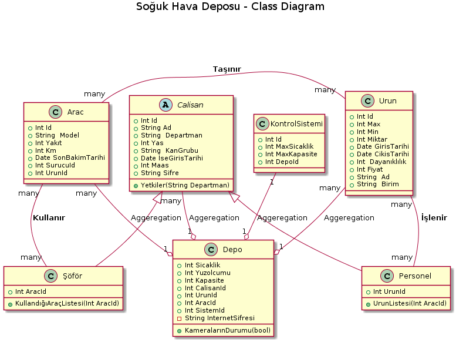

@startuml

title Soğuk Hava Deposu - Class Diagram

class Urun {
  +Int Id
  +Int Max
  +Int Min
  +Int Miktar
  +Date GirisTarihi
  +Date CikisTarihi
  +Int  Dayanıklılık
  +Int Fiyat
  +String  Ad
  +String  Birim  
  }

abstract class Calisan{
+Int Id
+String Ad
+String  Departman
+Int Yas
+String  KanGrubu
+Date İseGirisTarihi
+Int Maas
+String  Sifre
+Yetkiler()

}

class Depo{
+Int Sicaklik
+Int Yuzolcumu
+Int Kapasite
+Int CalisanId
+Int UrunId
+Int AracId
-String  InternetSifresi
+KameralarınDurumu(bool)

}

class Arac {

+Int Id
+Int ModelYili(Yasi)
+String  Model
+Int Yakıt 
+Int Km
+Date SonBakimTarihi
+Int SurucuId
+Int TasinanUrunId

}

Calisan <|-- Personel

Calisan <|-- Güvenlik

Calisan <|-- Şöför

Class Şöför{

+Int AracId

+DoldurmasıGerekenKm(Int AracId)

}

Depo "1" o-up- "many" Arac: Aggeregation
Depo "1" o-up- "many" Urun: Aggeregation
Depo "1" o-up- "many" Calisan: Aggeregation
Arac "many" -right- "many  " Urun   : **Taşınır**
Arac "1" -- "1" Calisan   : **Kullanır**
Urun "1" -- "many" Calisan   :** İşlenir**
@enduml
