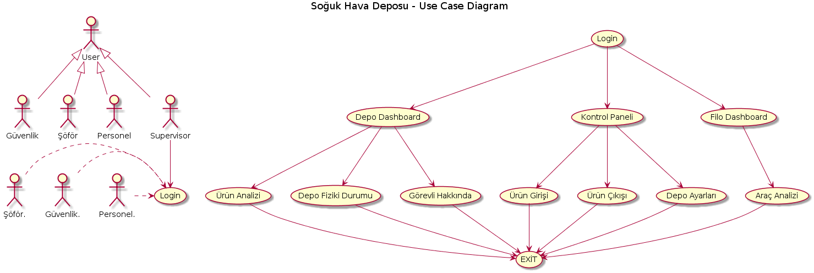

@startuml
title Soğuk Hava Deposu - Use Case Diagram 

Güvenlik -up-|> User 
Şöför -up-|> User
Personel -up-|> User
Supervisor -up-|> User

Şöför..> (Login)
Güvenlik..> (Login) 
Personel..> (Login)
Supervisor --> (Login)

(Login) as L
(Depo Dashboard) as (Depo)
(Kontrol Paneli) as KP
(Filo Dashboard) as Filo

L--> Depo
L--> Filo
L--> KP 

Depo --> (Ürün Analizi)
Depo --> (Depo Fiziki Durumu) 
Depo -down-> (Görevli Hakkında)
Filo--> (Araç Analizi)
KP --> (Ürün Girişi) 
KP --> (Ürün Çıkışı) 
KP --> (Depo Ayarları) 
(Ürün Girişi) -->(EXİT)
(Ürün Çıkışı) -->(EXİT)
(Depo Ayarları)-->(EXİT)
(Ürün Analizi) -->(EXİT)
(Görevli Hakkında) -->(EXİT)
(Depo Fiziki Durumu) -->(EXİT)
(Araç Analizi)-->(EXİT)
@enduml
