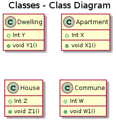

@startuml

title Classes - Class Diagram

class Dwelling {
  +Int Y
  +void Y1()
}

class Apartment {
  +Int X
  +void X1()
}

class House {
  +Int Z
  +void Z1()
}

class Commune {
  +Int W
  +void W1()
}