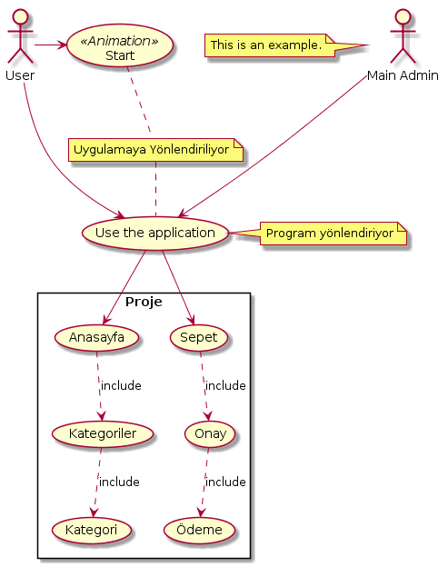

=== Use Case Örnek

@startuml
skinparam packageStyle rectangle
:Main Admin: as Admin
(Use the application) as (Use)
(Start) <<Animation>>

User -> (Start)
User -> (Use)

Admin ---> (Use)

note left of Admin : This is an example.

note right of (Use)
  Program yönlendiriyor
end note

note "Uygulamaya Yönlendiriliyor" as N2
(Start) .. N2
N2 .. (Use)

rectangle Proje
{
 (Anasayfa) .down->(Kategoriler) : include
  (Kategoriler) .down-> (Kategori) : include

  (Use)  -->(Anasayfa)
  (Use)  --> (Sepet)

  (Onay) .down-> (Ödeme) : include
  (Sepet) .down-> (Onay) : include
}
@enduml
