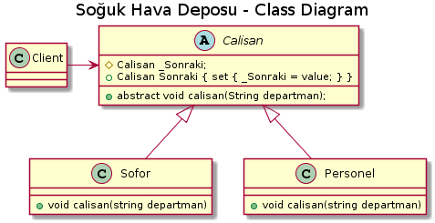

*Aşağıda  proje kodları ve plantUml kodları mevcuttur.*

   //Handler
   public abstract class Calisan
    {
        protected Calisan _Sonraki;
        public Calisan Sonraki { set { _Sonraki = value; }}
        public abstract void calisan(String departman);
    }
    
     class Personel : Calisan
    {
        public override void calisan(string departman)
        {
            if (departman == "Personel") {
                Console.WriteLine("{0} karar verme yetkisine sahiptir. ", departman); }
            else
            {
                if (_Sonraki == null)
                {
                    Console.WriteLine("Karar vermek için başka yetkili yoktur.");
                }
            }
        }
    }
    
    class Sofor: Calisan
    {
        public override void calisan(string departman)
        {
            if (departman == "Şöför")
            {
                Console.WriteLine("{0} karar verme yetkisine sahip değildir. ", departman);
            }
            else
            {
                if (_Sonraki != null)
                    _Sonraki.calisan(departman);
            }
        }
    }
    
    class Program
    {
        static void Main(string[] args)
        {
            Calisan dep1= new Sofor();
            Calisan dep2 = new Personel();
            dep1.Sonraki = dep2;
            dep1.calisan("Şöför");
            dep2.calisan("Personel");
            dep2.calisan("Müdür");
            Console.ReadKey();
        }
    }

 ---------------------------------------------
[uml,file="chainofresponsibility.png"]
@startuml

title Soğuk Hava Deposu - Class Diagram

abstract  Calisan
    {
        # Calisan _Sonraki;
        + Calisan Sonraki { set { _Sonraki = value; } }
        + abstract void calisan(String departman);
    }

class Sofor
    {
        +  void calisan(string departman)
    }

class Personel 
    {
       + void calisan(string departman)
    }
    
Calisan<|--Personel

Calisan<|--Sofor

Client-right->Calisan

@enduml