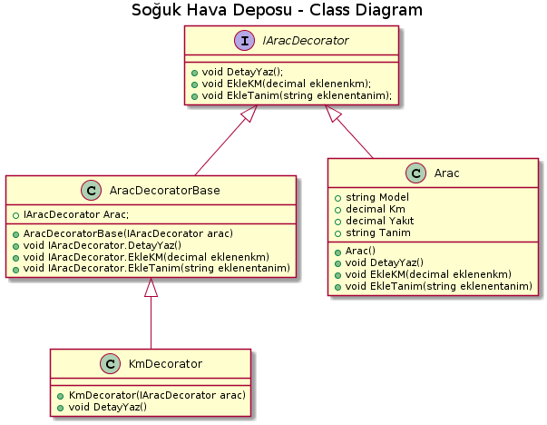

*Aşağıda  proje kodları ve plantUml kodları mevcuttur.*

   public interface IAracDecorator
    {
        void DetayYaz();
        void EkleKM(decimal eklenenkm);
        void EkleTanim(string eklenentanim);
    }
    
    public class AracDecoratorBase : IAracDecorator
    {
        internal IAracDecorator Arac;
        public AracDecoratorBase(IAracDecorator arac)
        {
            Arac = arac;
        }
        void IAracDecorator.DetayYaz()
        {
            Arac.DetayYaz();
        }
        void IAracDecorator.EkleKM(decimal eklenenkm)
        {
            Arac.EkleKM(eklenenkm);
        }
        void IAracDecorator.EkleTanim(string eklenentanim)
        {
            Arac.EkleTanim(eklenentanim);
        }
    }
    
    public class KmDecorator:AracDecoratorBase
    {
        public KmDecorator(IAracDecorator arac)
            : base(arac)
        {
        }
       public void DetayYaz()
        {
            base.Arac.EkleKM(50);
            base.Arac.EkleTanim(" Aracın bilgileri güncellendi");
            base.Arac.DetayYaz();
        }
    }
    
     class Arac : IAracDecorator
    {
        public string Model { get; set; }
        public decimal Km { get; set; }
        public decimal Yakıt { get; set; }
        public string Tanim { get; set; }
        public Arac()
        {
            Km = 300;
        }
        public void DetayYaz()
        {
            Console.WriteLine(Tanim);
        }
        public void EkleKM(decimal eklenenkm)
        {
            Km += eklenenkm;
        }
        public void EkleTanim(string eklenentanim)
        {
            Tanim = "Model: " + Model + "   Şuanki Km: " + Km + " Yakıt: " + Yakıt + " " + eklenentanim;
        }
    }
    
    class Program
    {
        static void Main(string[] args)
        {
            Arac arac = new Arac() { Model = "Astra", Km = 100, Yakıt = 120 };
            arac.DetayYaz();
            KmDecorator kmdeco = new KmDecorator(arac);
            kmdeco.DetayYaz();
            KmDecorator kmdeco2 = new KmDecorator(arac);
            kmdeco2.DetayYaz();
            Console.ReadLine();
        }
    }
    
    
 ------------------------------------------------
 
 
[plantUml,file="decorator.png"]
@startuml

title Soğuk Hava Deposu - Class Diagram

Interface IAracDecorator
{
    +void DetayYaz();
    +void EkleKM(decimal eklenenkm);
    +void EkleTanim(string eklenentanim);
}

class AracDecoratorBase
{
       +IAracDecorator Arac;
       +AracDecoratorBase(IAracDecorator arac)
       + void IAracDecorator.DetayYaz()
       + void IAracDecorator.EkleKM(decimal eklenenkm)
       + void IAracDecorator.EkleTanim(string eklenentanim)
}
    
class Arac 
{
        + string Model 
        + decimal Km
        + decimal Yakıt
        + string Tanim
        + Arac()
      + void DetayYaz()
      + void EkleKM(decimal eklenenkm)
      + void EkleTanim(string eklenentanim)
}
    
class KmDecorator
{
      +KmDecorator(IAracDecorator arac)
      + void DetayYaz()
}

IAracDecorator<|--Arac

IAracDecorator<|-- AracDecoratorBase

AracDecoratorBase<|--KmDecorator

@enduml