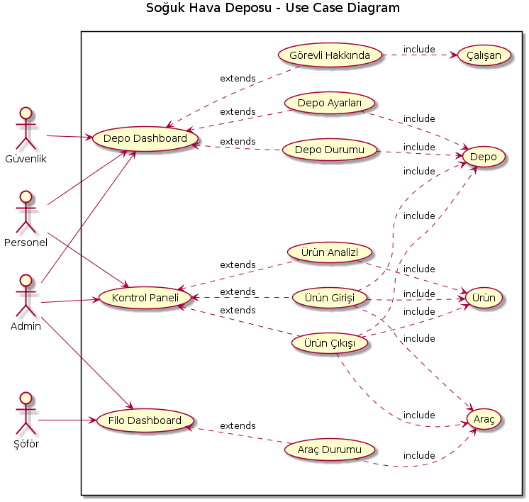

@startuml
title Soğuk Hava Deposu - Use Case Diagram 

left to right direction
skinparam packageStyle rectangle
rectangle {
 

(Depo Dashboard) as (DD)
(Kontrol Paneli) as KP
(Filo Dashboard) as Filo

KP <..  (Ürün Analizi) :extends
DD <.. (Depo Durumu) :extends
DD <..  (Görevli Hakkında) :extends
Filo <..  (Araç Durumu):extends
KP <..  (Ürün Girişi) :extends
KP <..  (Ürün Çıkışı) :extends
DD <..  (Depo Ayarları) :extends

(Ürün Girişi)..> (Ürün) :include
(Ürün Girişi)..> (Araç) :include
(Ürün Girişi)..> (Depo) :include
(Ürün Çıkışı)..> (Ürün) :include
(Ürün Çıkışı)..> (Depo) :include
(Ürün Analizi)..> (Ürün) :include
(Ürün Çıkışı)..> (Araç) :include
(Araç Durumu)..> (Araç) :include
(Görevli Hakkında)..> (Çalışan) :include
(Depo Durumu)..> (Depo) :include
(Depo Ayarları)..> (Depo) :include
}

Şöför-->(Filo)

Güvenlik-->(DD)

Personel--> (DD)
Personel--> (KP)

Admin -->(DD)
Admin -->(KP)
Admin -->(Filo)

@enduml