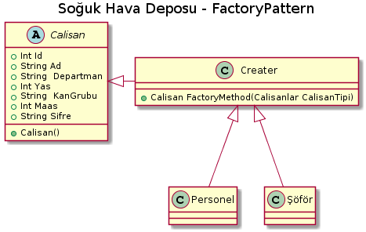

*Aşağıda plantUml kodları ve proje kodları mevcuttur.*

PROJE KODLARI :

 abstract class Calisan
    {
        int Id, Yas, Maas;
        string Ad, Departman, KanGrubu, Sifre;
        public abstract void calisan();
    }

  class Creater{ public Calisan FactoryMethod(Calisanlar CalisanTipi)
        {
            Calisan calisan = null;
            switch (CalisanTipi)
            {
                case Calisanlar.Personel:
                    calisan = new Personel();
                    break;
                case Calisanlar.Sofor:
                    calisan = new Sofor();
                    break;
            }
            return calisan;        } }
            
 class Personel : Calisan
    {
        public override void calisan()
        {
        Console.WriteLine("Bu personel departmanıdır ve çalışan sınıfından üretilmektedir.");
        }
    }

    class Sofor : Calisan
    {
        public override void calisan()
        {
            Console.WriteLine("Bu sürücü departmanıdır ve çalışan sınıfından üretilmektedir.");
        }
    }
    
 class Program
    {  static void Main(string[] args)
        {
            Creater creater = new Creater();
            Calisan calisan1 = creater.FactoryMethod(Calisanlar.Personel);
            Calisan calisan2 = creater.FactoryMethod(Calisanlar.Sofor);
            calisan1.calisan();
            calisan2.calisan();
            Console.Read();
        }
    }
    
    
PLANUML :

@startuml

title Soğuk Hava Deposu - FactoryPattern

abstract class Calisan{
+Int Id
+String Ad
+String  Departman
+Int Yas
+String  KanGrubu
+Int Maas
+String Sifre
+Calisan()

}

class Creater{

+ Calisan FactoryMethod(Calisanlar CalisanTipi)
}

Class Şöför{

}

Class Personel{

}

Creater <|-- Personel

Creater <|-- Şöför

Calisan<|-right-Creater

@enduml
