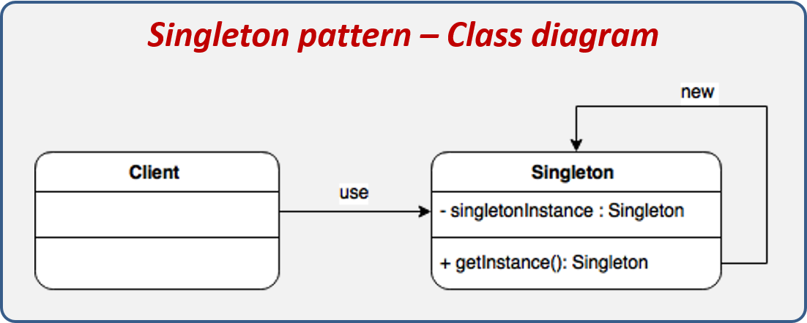
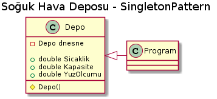

*Aşağıda plantUml kodları ve proje kodları mevcuttur.*

PROJE KODLARI :

class Program
{        static void Main(string[] args)
        {
        
            Depo depo1 = Depo.Depo_Nesnesi;
            depo1.Sicaklik = 5;
            Console.WriteLine("Depo2 nesnesi üretilip atama yapılmadan önce Depo1 Sıcaklık: " + depo1.Sicaklik+"\n\n");
            Depo depo2 = Depo.Depo_Nesnesi;
            depo2.Sicaklik = -10;
            if (depo1 == depo2)
            {
                Console.WriteLine("Nesneler singleton pattern ile üretildi.\n\n  Depo1 Sıcaklık: " + depo1.Sicaklik + "\n"+"  Depo2 Sıcaklık: " + depo2.Sicaklik);
                Console.Read();
            }
            else
            {
                Console.WriteLine("Nesneler farklıdır");
                Console.Read();
            }
        }
    }
    
    
     public class Depo
    {
       private static Depo dnesne;
        protected Depo() { }
        public static Depo Depo_Nesnesi
        {
            get
            {
                if (dnesne == null)
                {
                    dnesne = new Depo();
                }
                return dnesne;
            }
        }
        public double Sicaklik { get; set; }
        public double Kapasite { get; set; }
        public double YuzOlcumu { get; set; }
        public string InternetSifresi { get; set; }
    }
    
    
    
PLANUML :

@startuml

title Soğuk Hava Deposu - SingletonPattern

class Depo
{  -Depo dnesne
       +double Sicaklik 
       +double Kapasite 
       +double YuzOlcumu
        #Depo()
}

class Program{

}

Depo<|-right-Program

@enduml

