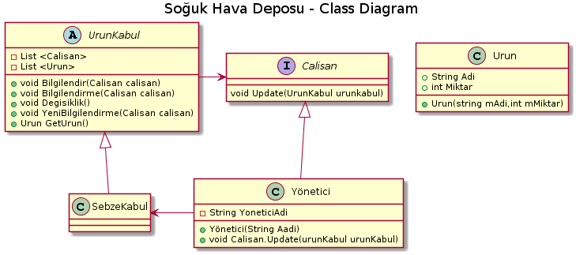

*Aşağıda  proje kodları ve plantUml kodları mevcuttur.*

 interface Calisan
    {
         void Update(urunKabul urunKabul);
    }
    
 class Yonetici : Calisan
    {
        private string yoneticiAdi;
        public Yonetici()
        {        }
        public Yonetici(string aadi)
        {
            this.yoneticiAdi = aadi; 
        }
        void Calisan.Update(urunKabul urunKabul) {
            Console.WriteLine(""+this.yoneticiAdi+" 'e "+urunKabul.GetUrun().Adi+" isimli üründen  "+urunKabul.GetUrun().Miktar+" kg miktarında giriş yapıldığı bilgisi aktarıldı.");
        }
    }

  abstract class urunKabul
    {
        private List<Calisan> calisanlar = new List<Calisan>();
        private List<Urun> urunler = new List<Urun>();
        private Urun Soğan;
        public void Bilgilendir(Calisan calisan)
        {
            calisanlar.Add(calisan);
        }
        public void Bilgilendirme(Calisan calisan)
        {
            calisanlar.Remove(calisan);
        }
        public void Degisiklik()  {
            foreach(Calisan calisan in calisanlar) {
                calisan.Update(this);
            }
        }
        public void YeniBilgilendirme(Urun urun) {
            urunler.Add(urun);
            this.Soğan = urun;
            Degisiklik();
        }
        public Urun GetUrun()
        {
            return Soğan;
        }
    }
    
    class SebzeKabul : urunKabul
    {
    }

 class Urun
    { 
       public String Adi { get; set; }
       public int Miktar { get; set; }
       public Urun(string mAdi,int mMiktar)
        {
            this.Adi = mAdi;
            this.Miktar = mMiktar;
        }
    }
  
  class Program
    {
        static void Main(string[] args)
        {
            urunKabul kabul = new SebzeKabul();
            Calisan yonetici = new Yonetici();
            kabul.Bilgilendir(new Yonetici("Murat Bey"));
            kabul.YeniBilgilendirme(new Urun("Soğan",5000));
            // Murat bey oluşturulduğu için bundan sonrakilerde otomatik bilgilendirilcek !!!
            kabul.Bilgilendir(new Yonetici("Sinan Bey"));
            kabul.YeniBilgilendirme(new Urun("Havuç", 750));
            Console.Read();
        }
    }

  ---------------------------------------------
[plantuml,file="observer.png"] 
@startuml

title Soğuk Hava Deposu - Class Diagram

abstract class UrunKabul{

-List <Calisan>
-List <Urun>
+void Bilgilendir(Calisan calisan)
+void Bilgilendirme(Calisan calisan)
+void Degisiklik()
+void YeniBilgilendirme(Calisan calisan)
+Urun GetUrun()
}

class SebzeKabul{

}

class Yönetici{
-String YoneticiAdi
+Yönetici(String Aadi)
+void Calisan.Update(urunKabul urunKabul)
}

class Urun{
+String Adi 
+int Miktar
+Urun(string mAdi,int mMiktar)
}

Interface Calisan{

void Update(UrunKabul urunkabul)
}

Calisan<|--Yönetici
UrunKabul<|-- SebzeKabul
SebzeKabul<-left-Yönetici
UrunKabul -right->Calisan

@enduml