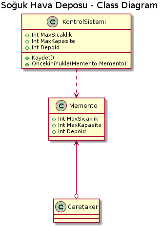

*Aşağıda  proje kodları ve plantUml kodları mevcuttur.*

 

 class Memento
    {
        public int MaxSicaklik { get; set; }
        public int MaxKapasite { get; set; }
        public int DepoId { get; set; }
    }

 class Caretaker
    {
        public Memento Memento { get; set; }
    } }
    
     class KontrolSistemi
    {
        public int MaxSicaklik { get; set; }
        public int MaxKapasite { get; set; }
        public int DepoId { get; set; }
        public override string ToString()
        {
            return $" Maksimum Sıcaklık : {MaxSicaklik} Maksimum Kapasite : {MaxKapasite} Depo No : {DepoId}";
        }
        public Memento Kaydet()
        {
            return new Memento
            {
                MaxSicaklik = this.MaxSicaklik,
                MaxKapasite = this.MaxKapasite,
                DepoId=this.DepoId
            };
        }
        //T anındaki nesneye bizi ulaşturacak olan metod.
        public void OncekiniYukle(Memento Memento)
        {
            this.MaxSicaklik = Memento.MaxSicaklik;
            this.MaxKapasite = Memento.MaxKapasite;
            this.DepoId = Memento.DepoId;
        }
    }

 class Program
    {
        static void Main(string[] args)
        {
            KontrolSistemi sistem = new KontrolSistemi();
            sistem.MaxSicaklik=-10;
            sistem.MaxKapasite =2300;
            sistem.DepoId = 1;
            Console.WriteLine(sistem.ToString());
            Caretaker Taker = new Caretaker();
            //T anında ilgili SekSek nesnesini kopyalıyoruz ve
            //CareTaker nesnesi içerisindeki Memento'ya bağlıyoruz.
            Taker.Memento = sistem.Kaydet();
            sistem.MaxSicaklik =-12;
            sistem.MaxKapasite =1850;
            sistem.DepoId = 1;
            Console.WriteLine(sistem.ToString());
            //T anında kopyaladığımız nesneye CareTaker üzerinden erişiyor
            //ve ilgili Originator nesnemize load ediyoruz.
            sistem.OncekiniYukle(Taker.Memento);
            Console.WriteLine(sistem.ToString());
            Console.Read();
        }
    }
   
   ---------------------------------------------

[plantuml,file="memento-classdiagram.png"] 

@startuml

title Soğuk Hava Deposu - Class Diagram

class KontrolSistemi{

+Int MaxSicaklik
+Int MaxKapasite
+Int DepoId
+Kaydet():
+OncekiniYukle(Memento Memento):
}

class Memento{

+Int MaxSicaklik
+Int MaxKapasite
+Int DepoId
 }

KontrolSistemi ..>  Memento
Caretaker  o-up-> Memento

@enduml